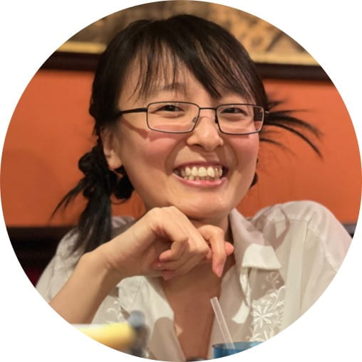
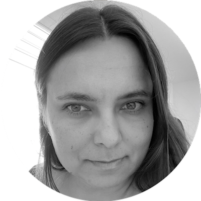
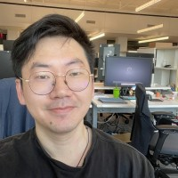
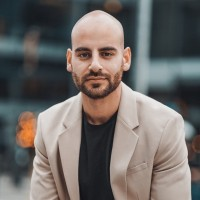
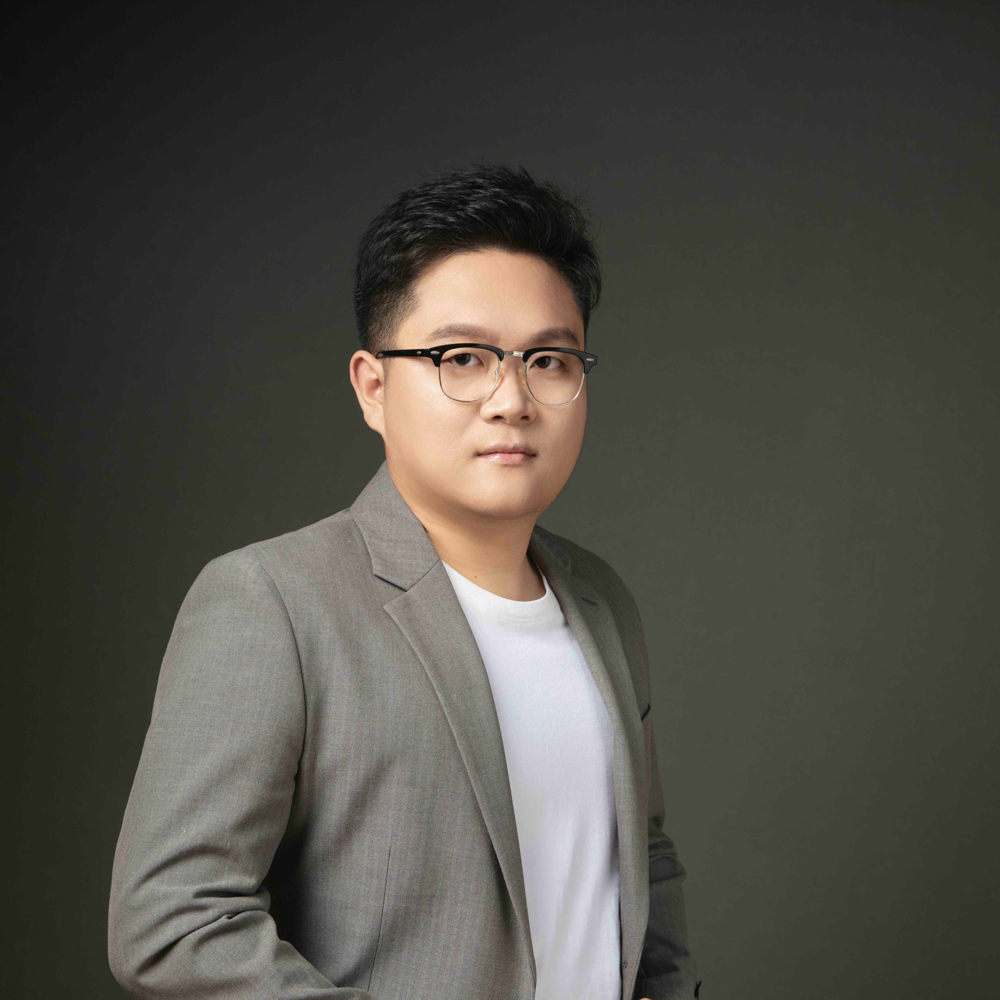
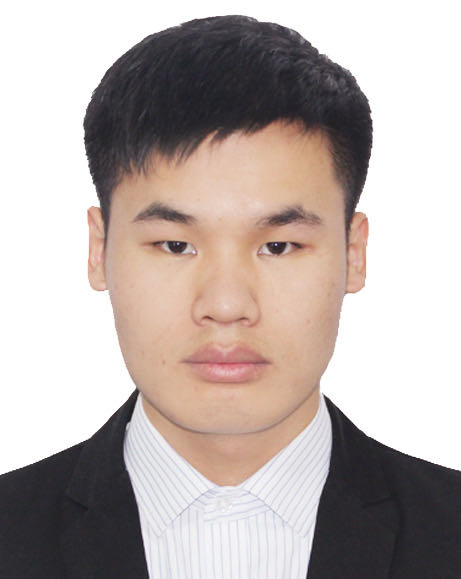
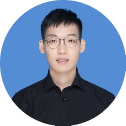

# Organizers

<!-- * Shiwei Liu
* Kai Han
* Adriana Fernandez-Lopez
* Ajay Jaiswal
* Zahra Atashgahi
* Boqian Wu
* Rebekka Burkholz
* Edoardo M. Ponti
* Cong Hao
* Olga Saukh
* Lu Yin
* Tianjin Huang
* Andreas Zinonos
* Jared Tanner
* Yunhe Wang -->

<table cellspacing="0" cellpadding="0" style="border-collapse: collapse;">
    <tr>
        <td style="text-align: center; border: none;">
        <figure><figcaption>Shiwei Liu, University of Oxford</figcaption></figure></td>
        <td style="text-align: center; border: none;"><figure><figcaption>Kai Han, Huawei Noah’s Ark Lab</figcaption></figure></td>
        <td style="text-align: center; border: none;"><figure><figcaption>Adriana Fernandez-Lopez, Meta AI</figcaption></figure></td>
    </tr> 
    <tr>
        <td style="text-align: center; border: none;">
        <figure><figcaption>Ajay Jaiswal, University of Texas</figcaption></figure></td>
        <td style="text-align: center; border: none;"><figure><figcaption>Zahra Atashgahi, University of Twente</figcaption></figure></td>
        <td style="text-align: center; border: none;"><figure><figcaption>Boqian Wu, University of Twente</figcaption></figure></td>
    </tr> 
        <tr>
        <td style="text-align: center; border: none;">
        <figure><figcaption>Rebekka Burkholz, CISPA</figcaption></figure></td>
        <td style="text-align: center; border: none;"><figure><figcaption>Edoardo M. Ponti, University of Edinburgh</figcaption></figure></td>
        <td style="text-align: center; border: none;"><figure><figcaption>Callie Hao,  Georgia Tech</figcaption></figure></td>
    </tr> 
        <tr>
        <td style="text-align: center; border: none;">
        <figure><figcaption>Olga Saukh, TU Graz</figcaption></figure></td>
        <td style="text-align: center; border: none;"><figure><figcaption>Lu Yin, University of Surrey</figcaption></figure></td>
        <td style="text-align: center; border: none;"><figure><figcaption>Tianjin Huang,  University of Exeter</figcaption></figure></td>
    </tr> 
        <tr>
        <td style="text-align: center; border: none;">
        <figure><figcaption>Andreas Zinonos, Imperial College London</figcaption></figure></td>
        <td style="text-align: center; border: none;"><figure><figcaption>Jared Tanner, University of Oxford</figcaption></figure></td>
        <td style="text-align: center; border: none;"><figure><figcaption>Yunhe Wang, Huawei Noah's Ark Lab</figcaption></figure></td>
    </tr> 
    <tr>
        <td style="text-align: center; border: none;">
        <figure><figcaption>Songyang Zhang, Shanghai AI Laboratory</figcaption></figure></td>
        <td style="text-align: center; border: none;"><figure><figcaption>Zhongqian Fu, Huawei Noah's Ark Lab</figcaption></figure></td>
        <td style="text-align: center; border: none;"><figure><figcaption>Yehui Tang,   Huawei Noah's Ark Lab</figcaption></figure></td>
    </tr> 
</table>
